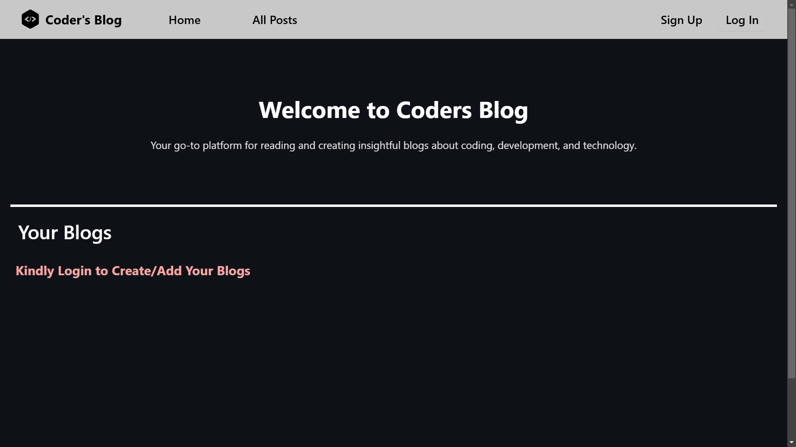

# Coder's Blog

Dive into the world of full-stack development with this React-based blog application powered by AppWrite's robust backend. Create and share engaging blog posts with ease, utilizing the intuitive Tiny Markdown Editor for rich text formatting and image integration. Seamlessly store and retrieve data using AppWrite's powerful database and storage solutions. Explore the dynamic community by reading and interacting with other users' posts.

## Technologies Used

- HTML
- CSS
- Javascript
- Tailwind
- React
- Appwrite

## Getting Started

This section explains how to set up your project locally for development.

### Prerequisites

Make sure you have the following installed on your local machine:

- **Node.js**: [Download and install](https://nodejs.org/)
- **npm** or **yarn**: Comes bundled with Node.js.

### Installation

To install the project, follow these steps:

1. **Clone the repository:**

   ```bash
   git clone https://github.com/debugger-snjy/Coders-Blog
   ```

2. **Installing the Node Packages:**

   ```bash
   npm install
   ```

3. **Running the Application:**

   ```bash
   npm start
   ```

## Screenshots

Login Page:



## Important Links

### AppWrite

[Account and Auth API Docs](https://appwrite.io/docs/references/cloud/client-web/account)

[Database API Docs](https://appwrite.io/docs/references/cloud/client-web/databases)

[Storage API Docs](https://appwrite.io/docs/references/cloud/client-web/storage)

### React

[Forward Ref From Log Rocket](https://blog.logrocket.com/use-forwardref-react)

[Forward Ref From React Legacy](https://legacy.reactjs.org/docs/forwarding-refs.html)

[Forward Ref From React Dev](https://react.dev/reference/react/forwardRef)

### React Hook Form

[Different Validation Methods](https://react-hook-form.com/get-started#Applyvalidation)
